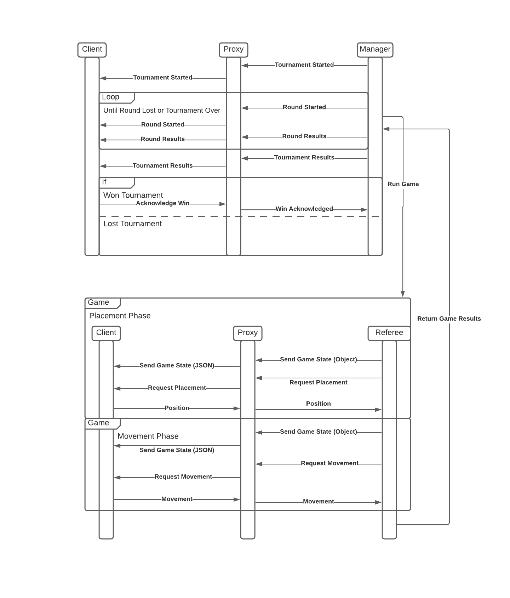

This diagram specifies the communication process between remote players
our internal server components.

A player communicates with our tournament manager and referees
through a PlayerProxy which implements our PlayerInterface.

A player communicates to a PlayerProxy through their client which
contains their own implementation of a PlayerInterface Object.

A Manager or Referee will call of the ProxyPlayer to give/request information,
which in turn will send JSON messages to the the player's client.
THe player's Client will use the information that it receives from
the ProxyPlayer to call on the same methods in the player's PlayerInterface
Object, which will then give information to the Client to 
send as JSON data back to the ProxyPlayer.

The ProxyPlayer sends JSON messages in the following format:
 
        
{"Method": "method_name", "Parameters": [arguments...]}

{"Method": "assignColor", "Parameters": [Color]}

    Color is one of "RED", "BROWN", "BLACK", "WHITE"
            
{"Method": "updateGameState", "Parameters": [ State ]}

    State is a { "players" : Player*, "board" : Board, "turn": Integer }
    
        Player* is [Player, ..., Player]
        INTERPRETATION The array lists all players and specifies the order in which they take turns.
        
            Player is { "color" : Color, "score" : Natural, "places" : [Position, ..., Position] }
                Position is a JSON array that contains two natural numbers:
                  [board-row,board-column].
                   INTERPRETATION The position uses the computer graphics coordinate system meaning the Y axis points downwards. The position refers to a tile with at least one fish on it.
               

         Board is a JSON array of JSON arrays where each element is
            either 0 or a number between 1 and 5.
            The size of the board may not exceed a total of 25 spots.
            INTERPRETATION A 0 denotes a hole in the board configuration. All other
            numbers specify the number of fish displayed on the tile. 
        
        Turn is an integer that ranges from 0 to the number of players - 1 to cover that number of turns.
        INTERPRETATION: Turn is the current turn number in the state. This will be used to determine which player can move or place a penguin.
        
{"Method": "placeAvatar", "Parameters": [ State ] }

{"Method": "moveAvatar", "Parameters": [ State ] }

{"Method": "endOfGame", "Parameters": [ Score ] }

    Score is a Postitive-Integer
    INTERPRETATION: Score represents the total amount of fish that a player collected in a game
    
{"Method": "notifyTournamentUpdate", "Parameters": [ TournamentUpdate ] }

    TournamentUpdate is a { "Type": TournamentUpdateType , "body": String }
    INTERPETATION: A TournamentUpdate is a message from a tournament manager that informs a player of its current status in the tournament
    
        TournamentUpdateType is one of "TournamentStart", "RoundWin", "RoundLoss", "TournamentWin"
            - "TournamentStart" informs a player that the tournament is starting
            - "RoundWin" informs a player that they have run a round and will proceed to the next round/phase
            - "RoundLoss" informs a player that they have been eliminated form the tournament
            - "TournamentWin" informs a player that they have won a tournament
                Players must acknowledge a TournamentWin message in order to secure their victory
                       

A player responds to "placeAvatar" with a Position

    A Postion is a JSON array [ Row, Column ]
    INTERPRETATION: the position the player wants to place a penguin at

A player responds to "moveAvatar" with an Action
    
    An Action is a Movement specified by a "from" Postion and a "to" Position: [ Position, Position]
    INTERPRETATION The array describes a postion where a player has a penguin, and a position where they can legally move to