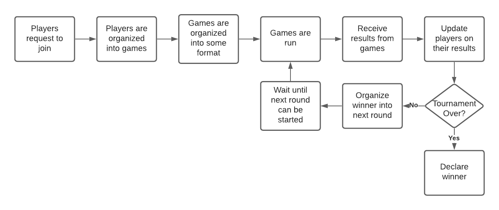
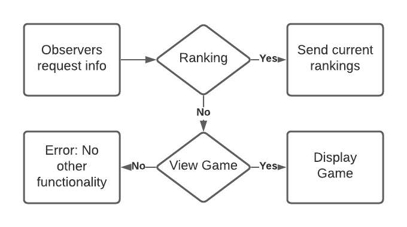

# Tournament Manager

## Setting up a tournament

- Accept requests to join tournament from players
- Organizes players into games.
- Sets up those games with a referee.
- Organizes games into some tournament format (ie. round robin).

## Running the tournament

- Tell referees to run games
- Once games finish, if the next game can be started then do so, otherwise wait until it can be.
- If there are no games left then there is a tournament winner, so declare it.

## Player interaction

- Inform players of any prizes they won along with their tournament placement once they drop out.

## Referee interaction

- Receive game results from referees once games finish

## Observer interaction

- Display tournament rankings
- Possibly allow live spectating of games

## General flow

## Observer flow

